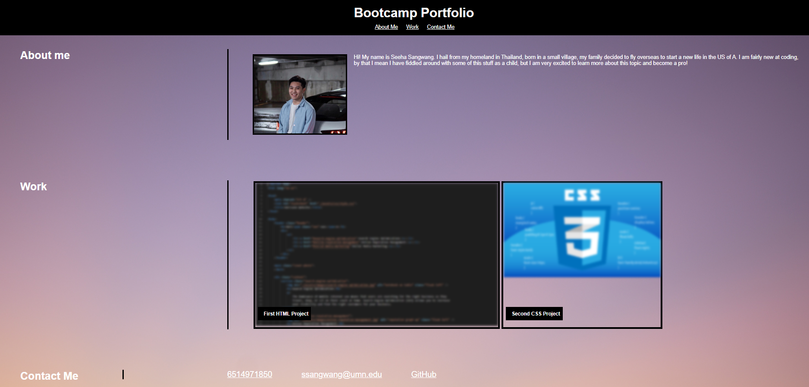
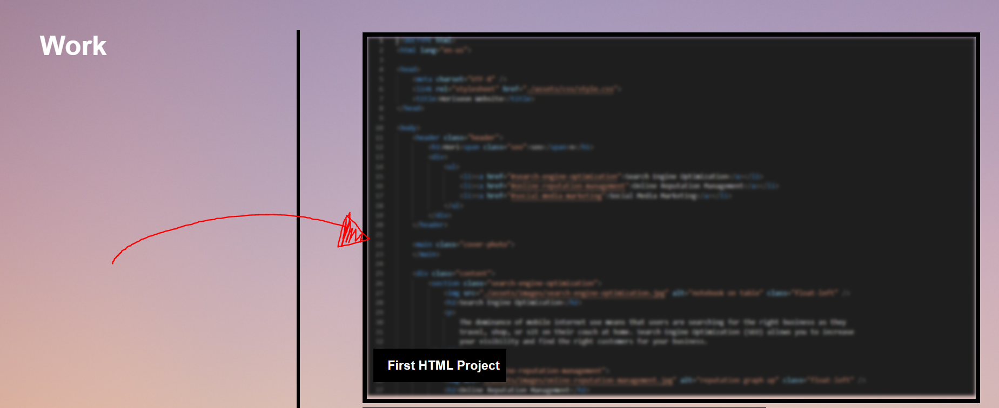

# Module-2-Challenge

## Description
This portfolio was created to excerise my knowledge of CSS and HTML as learned in the bootcamp. It is also a portfolio to show to future employers/contracters to showcase my current/future knowledge of the elements I am learning in class.

## Installation
N/A

## Usage

Visit this link to view website: https://ssangwang.github.io/Module-2-Challenge/

Navigate to the "Work" section and select on a project you wish to view! 

## Credits 
N/A

## License
See repository
